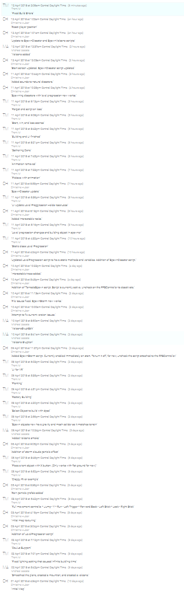

# Project 02 Report
[Download Link](https://github.com/Trentm95/CS4331-VR/releases/tag/v0.1-alpha)

*insert link to video demo*

*insert project screenshot*

## Game Description
This is a standalone, first-person, survival game in which the goal is to build your civilization as large as possible while keeping below a certain water pollution threshhold. In order to build your civilization, you must collect enough resources to construct a structure. More buildings become available as you level up. As you build your civilization, you will gain civilization points; however, you will also increase water pollution. Some structures help decrease water pollution - such as water treatment structures. You must achieve enough civilization points in order to level up. Natural disasters such as storms and volcanoes will be triggered throughout level progression that contribute to water pollution. If you exceed the water pollution threshhold, you lose the game. If you reach the max civilization level, you win the game.

## Getting Started
We chose to develop our game in [Unity](https://unity3d.com/), and we imported free model assets from the [Unity Asset Store](https://assetstore.unity.com/). The scripts were to be done in Unity's default programming language, C#. For the island design, we imported a height map of the Kaua'i island in Hawaii, and smoothed out any rough edges so the player could navigate with ease.

## Duties
### Trent
- Setting up Oculus Rift & Xbox controls
- Resource gathering
- Structure building/progression
- UI overlays

### Michael
- Natural disasters
  - Volcano
  - Tsunami
- Map smoothing/terraforming

### Christine
- Natural disasters
  - Storm
  - Tornado
- Integrating disasters into level progression
- Level progression interface
- Map texturing

## Screenshots
-Island 

  -The island was created by duplicating the map of Kauai and sizing it to a large scale for our game’s base! Once we got the basis of   -Kauai, we altered the land to include a volcano in the middle with flat land surrounding it. 
-Ocean and lakes

  -The ocean and lakes were created using the Environmental Asset Package that included Water and Water pro packages. 
-Rocks

  -We imported a unity packed for rocks so that it added an extra sense of reality to the game. 
-Pick Axe

  -The Pick Axe was an object that was imported, which is used to chop down the trees and collect wood to create new houses or items. 
-Tents

  -The tent is the first imported object that is given to the user when they start the game. 
-Bushes

  -Bushes were imported for the user to add to the environment to help start reducing the pollution. 
-Water treatment plant

  -At higher levels, the user can collect enough materials to create the imported Water Treatment Plant to help reduce the pollution  -   -tremendously. 
-House

  -After the player gets to higher levels, they will be able to create a medieval home, which increaseas pollution by some points, too.
-Trees

  -In our game, we have 2 different types of trees, some that were imported from the terrain package and another that was imported from   -the asset store. We created different tree’s to allow for the destruction of the trees when they are being “cut down”. 
-Rain Storm 

  -The rain storm was simulated by changing the sky box to grey, and having a cloud drop particles of rain in a radius around the   - -   -player. This rain cloud follows the user where ever they go; thus, simulating that the storm is everywhere across the map. 
-Tornado

  -The tornado was created by using a particle system and rotating the particle system to create the look of a tornado. 
-Volcano

  -The volcano was created by using another particle system that shoots out particles and uses gravity to make the particles fall in a -  -similar fashion to volcanoes. 
-Tsunami

  -The tsunami was created by importing a model of a wave and making it move across the map. During this time, the ocean levels also       -rise significantly. 

## Obstacles and Issues
While our team was building this project, we encountered many different obstacles that affected the outcome of the game. The main obstacle that we encountered was the time availibility of the group to get togehter and work on the project. After overcoming this issue, we encountered an issue with cutting down a tree by distroy it, without destroying other nearby trees. This was overcome by importing two separate trees, and allowing one to be deletable. We also encountered some issues with pushing an instance of the game over the work of another player, deleting the work that they had recently completed. Lastly, we encountered could not find a package of a wave that can act as the Tsunami. Each of these issues and obstacles slowed down the production of the project, but we were able to over come most of these obstaces and create a great game!  

## Conclusion
The Island Surivial Project game is a simple way to understand pollution and allow the user to understand and learn different methods of reducing pollution. Water pollution can be caused by many factors that range from building homes and factories to natural disasters, such as tornados and volcanos. Therefore, when the user plays the game, they are in a situation where there is water pollution slowly growing, and they have to strive for reducing the pollution and avoid exceeding a certian pollution threshold. The user must get through as many levels as possible, by keeping the pollution low. Although there are many other ways to reduce pollution, the user will learn to plant bushes and build water treatment plants to reduce water pollution.  

## Source Control Timeline
*Update after final push*

