# CS4331-VR Project 3
### [Demo Link](https://github.com/Trentm95/CS4331-VR/releases/tag/Lit-v1)

### [Video Link](https://streamable.com/38s09)

## Game Description
This is a standalone, first person shooter game where the player must survive as many rounds as possible. Enemies will come in waves, and the player must defeat each wave in order to advance to the next round. The waves will become increasingly harder as the rounds progress. The fighting style revolves around the idea of the four elements - air, water, fire, and earth. The enemies will be elementals, each representing a specific element. The player will wield the power of the four elements in order to defeat these enemies. The player must decide which element to wield depending on the enemy. For example, if the enemy is a fire elemental, the player must wield the element of water in order to defeat it. There is not a finite amount of rounds to win; the player will just last as many rounds as they possibly can.

## Getting Started
We chose to develop our game in [Unity](https://unity3d.com/), and we imported free and paid model assets from the [Unity Asset Store](https://assetstore.unity.com/). The scripts were to be done in Unity's default programming language, C#. For the floor and projectile designs, we utilized [Adobe Photoshop](https://www.adobe.com/products/photoshopfamily.html) to create our own designs.

## Duties
### Trent
- Set Up Oculus Rift & Oculus Touch Controls
- Shooting Mechanics
- UI
- Music/Sounds

### Christine
- Map Creation
- Enemy AI
- Progression Interface
- Round Control/Wave Spawns

### Michael
- Projectiles
- Particle Systems

## Screenshots
### Elementals
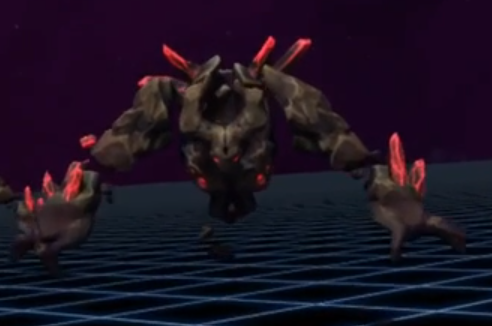
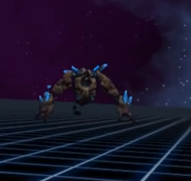
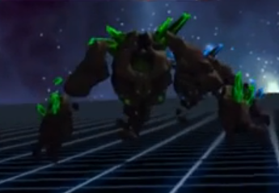
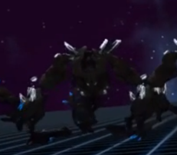

### Map
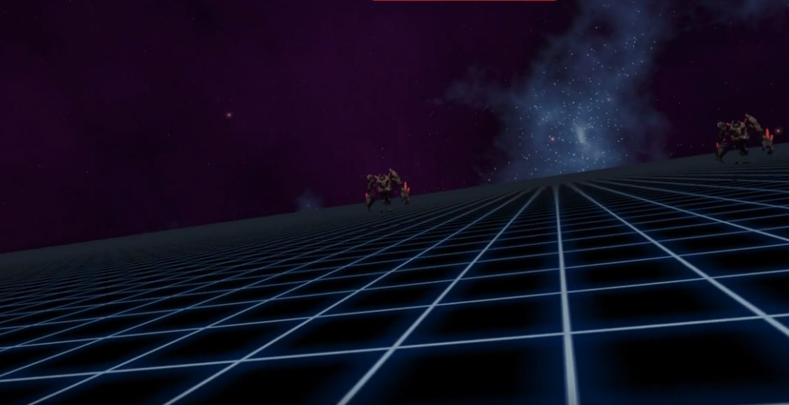

### Oculus Touch Controls
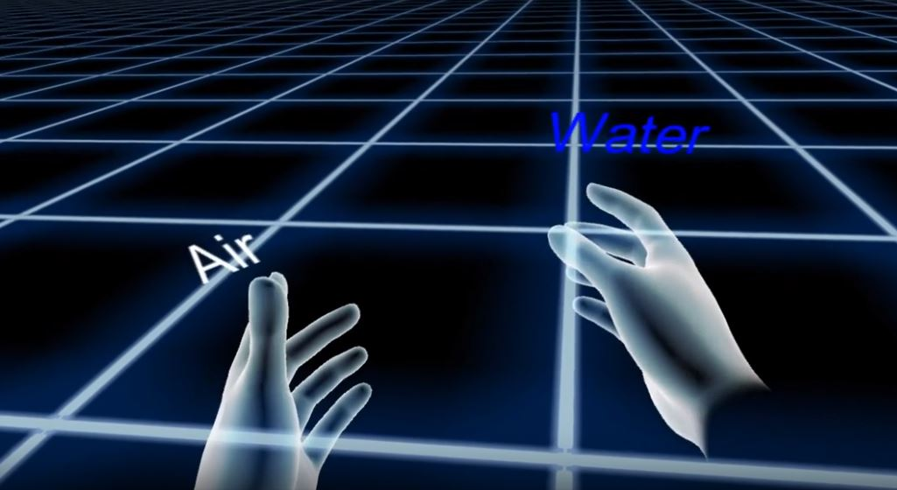

### Projectiles
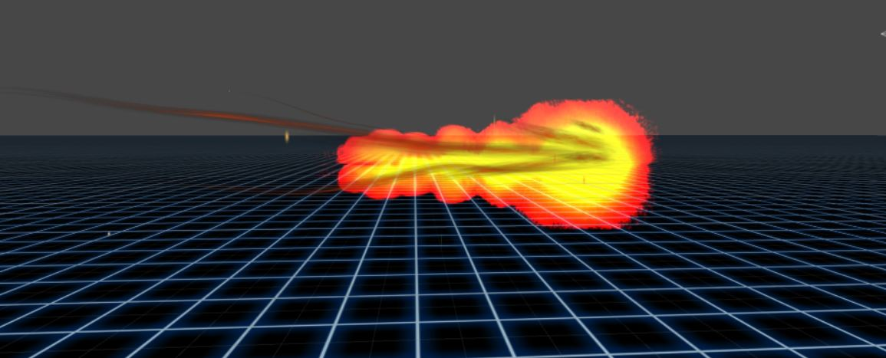
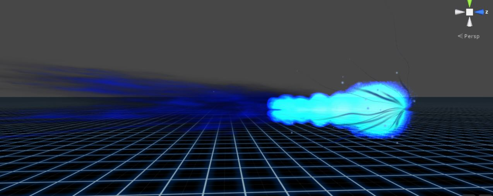
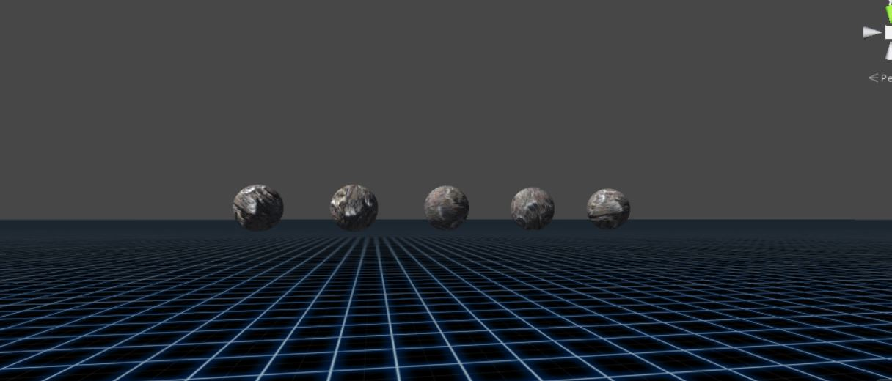
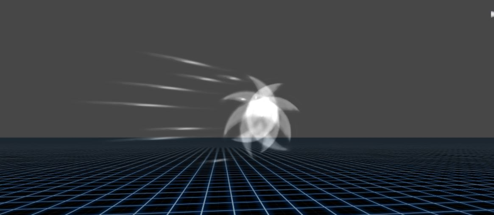

### Start/End Screens
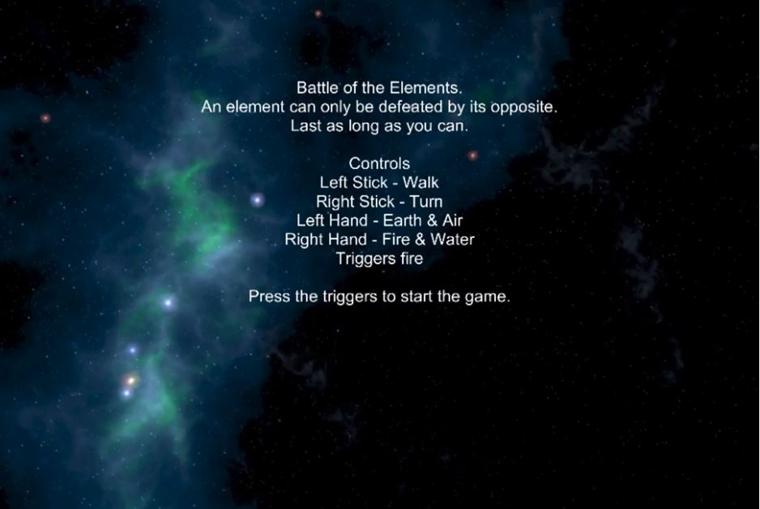
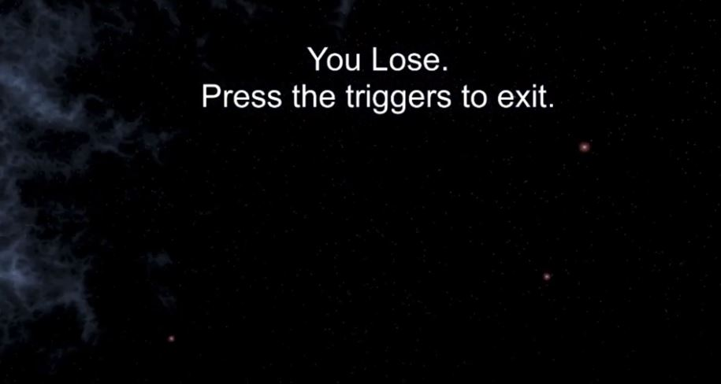

### In-Game UI
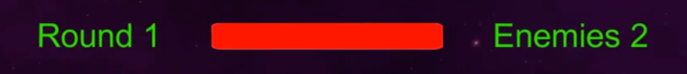

## Obstacles & Issues
### Testing
For those of us that did not have an Oculus Rift at our disposal, we needed to utilize the normal FPS controls that Unity provides in their character package. This caused some difficulties when testing features as things developed for the FPS controls would not work for the Oculus and vice versa. Luckily, the team was very good with communication amongst one another and we were able to solve problems quickly.

### AI Attacks
A 5 second delay was implemented at the start of each round to give the player time to view their enemies and prepare. This 5 second delay was done using Unity's *coroutine*. This caused some issues as Christine could no longer put the enemy attack logic in the update function to be called every frame. Christine needed the enemy to attack repeatedly if it was in range of the player, therefore she needed some way to loop the attack; however, a *coroutine* does not loop. Christine looked into using a *while* loop, but this caused Unity to freeze. Eventually, she found a way to utilize Unity's *InvokeRepeating* function in order to call the attack function over and over. It would repeat until the enemy was no longer in range of the player. Once the enemy is out of range, Unity's *CancelInvoke* function would cancel the attack until the enemy is in range of the player again.

There were some major issues that were encountered when creating the projectiles. The projectiles were created in Adobe Photoshop by hand, and Photoshop made Michael's computer crash three times, deleting his creations. Therefore, after hours of figuring it out, he was able to save his work before it crashed and finish the projectiles in Unity. There were also some issues making the particles that were coming out of the projectiles attach to the object and fly with them when they were shot out.

## Conclusion
This game is a first person shooter game that uses the Oculus with controlers to allow the user to play the game. Our game starts off by giving the users time to read the instructions on how to play the game and then drops them into the field of gameplay. At the start of gameplay, there are elementals that start coming after the player. The user has four different abilities that they can use to fight against the elementals that are coming at them. At first, there are only two elementals that come after the user, but as the player progresses through the game, more and more elementals will spawn. To kill the elementals, the user must use the proper ability that weakens each elemental; Fire kills the water elemental, water kills the fire elemental, air kills the earth elemental, and earth kills the air elemental. The main goal of this game is for the user to stay playing as long as they can until they end up losing all their health from the elementals! 

## References
* [Oculus Docs](https://developer.oculus.com/develop/)
* [Sound Effects](http://www.wowhead.com/sounds)
* [Projectile Tutorial](https://www.youtube.com/watch?v=DEtZUeVY9qk)

## Source Control Timeline

