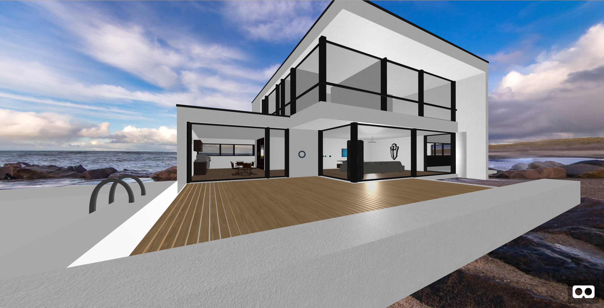
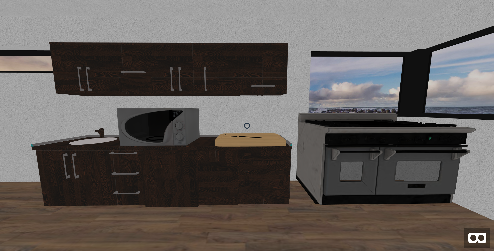
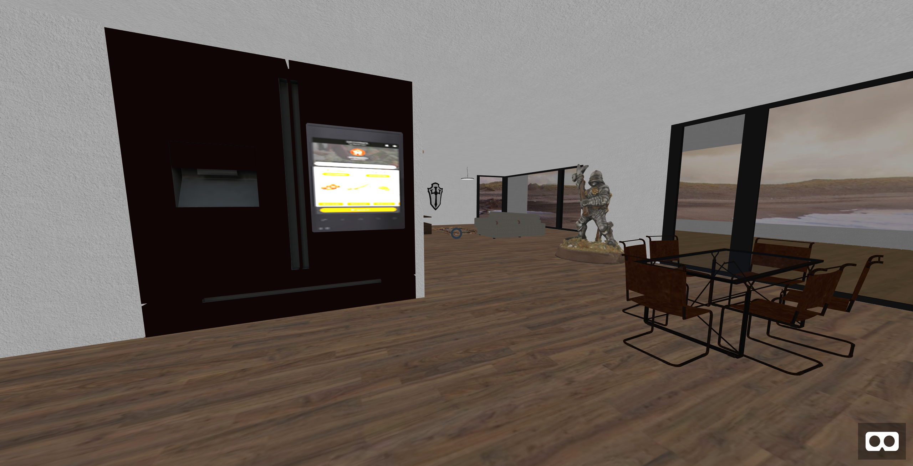
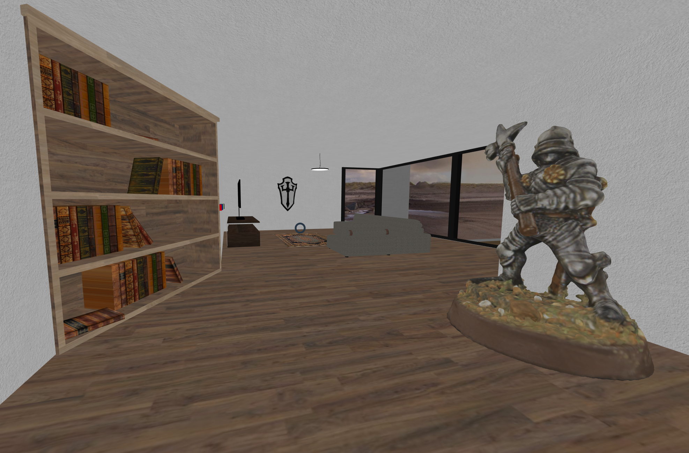
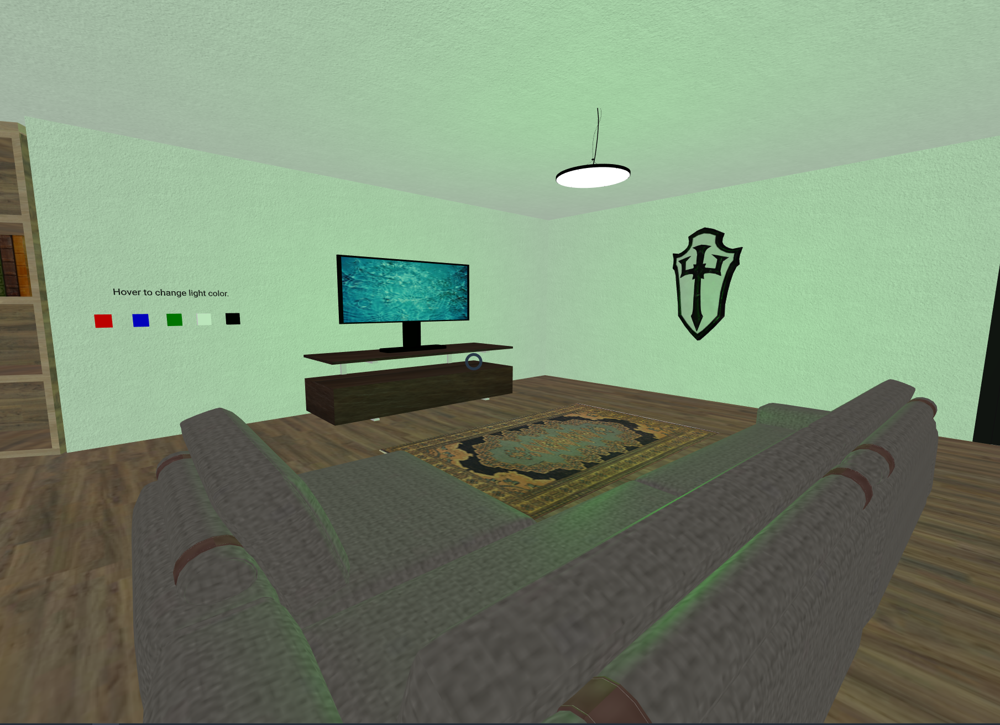
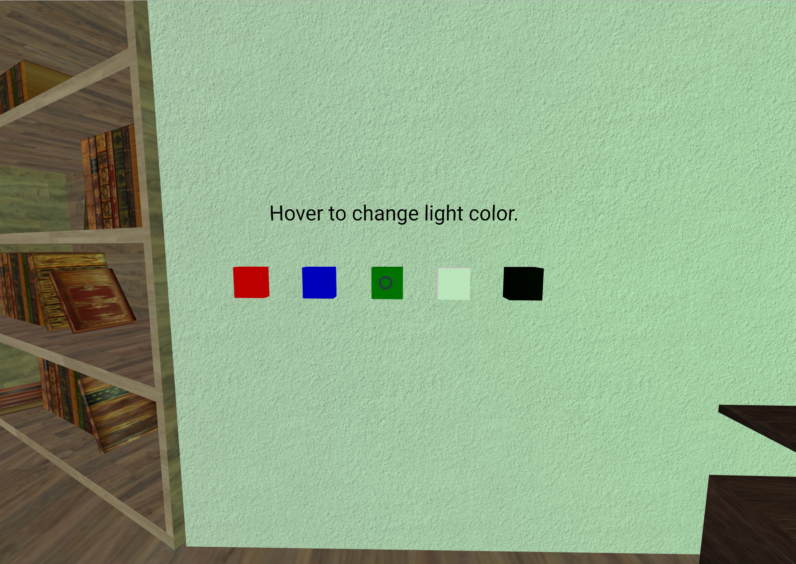
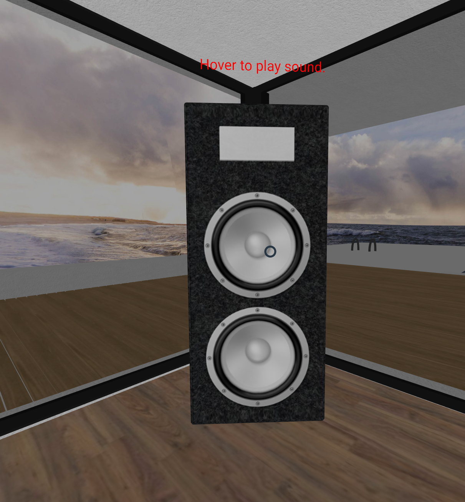

# Project 1
* [Video Link](https://drive.google.com/file/d/1IWG76nO3XjFVsEp83P52xmdboabhr1fo/view?usp=sharing)
* [Demo Link](https://trentm95.github.io/CS4331-VR/Project1/)
* [Source Code](https://github.com/Trentm95/CS4331-VR/tree/master/Project1)

## Description

The goal of this project was to create a virtual reality home. This project was made using the A-frame library, Sketchfab for gltf models, and Photoshop for texture downscaling.

### Outside View

An outside view of the house. For this project I decorated the large bottom floor room. You can also see the ocean skybox in the background.

### Kitchen

The kitchen contains cabinets with sink, microwave, cutting board, oven, smart fridge, and table with chairs.

### Middle

The middle part of the house contains a book shelf and a statue of a knight.

### Living Room
The living room contains a TV, sofa, rug, decorative shield, speaker and hanging light.

### Light Control
To control the lighting color you can hover over the colored cubes. Black turns off the light.

### Speaker
To play the cantina music from Star Wars hover over the speaker.

## References
* https://aframe.io/docs/
* https://github.com/Alex-Nguyen/CS5331001-Virtual-Reality
* https://github.com/donmccurdy/aframe-extras
* https://sketchfab.com/

## Asset Sources

* [House Model](https://www.blendswap.com/blends/view/80830)
* [Bookshelf Model](https://sketchfab.com/models/b8f46cf7daca419a87ac8d131bad056f)
* [Fridge Model](https://sketchfab.com/models/d2d06c12322948c980877bf81fe42745)
* [Kitchen Counter Model](https://sketchfab.com/models/3b540ab5964a428c8cb4563ed737d2c7)
* [Stove Model](https://sketchfab.com/models/9b4ac1e7593246159e65e4362a9c5de5)
* [Dining Table Model](https://sketchfab.com/models/c41a27d7a1b24dc484bc603e1bc2d0ef)
* [Sofa Model](https://sketchfab.com/models/c05907ca713345649c3ae5239069a885)
* [TV Model](https://sketchfab.com/models/ce237530639441e28869b44297587e5a)
* [Rug Model](https://sketchfab.com/models/fe13eecfc9b8405dab1fe76c5dd28a4c)
* [Shield Model](https://sketchfab.com/models/b436c3cde1d346a08926affa7a313f32)
* [Knight Model](https://sketchfab.com/models/fdd6ff9d89bf45e8b6493d8d396bd025)
* [Ceiling Lamp](https://sketchfab.com/models/50cef2c4bec346358b004ca213a6ba26)
* [Speaker](https://sketchfab.com/models/0225e32494d04b50bff1f1801ecc46e5)
* [Cutting Board](https://sketchfab.com/models/599257ecf79d4df6827f379c75bff0d9)
* [Microwave](https://sketchfab.com/models/365dcf8d326b4f4f9a3fdea25c7e27e8)
* [Cantina MP3](http://mattersofgrey.com/star-wars-ringtones/)
* [Skybox](https://www.flickr.com/photos/hamburgerjung/28019644509/)
