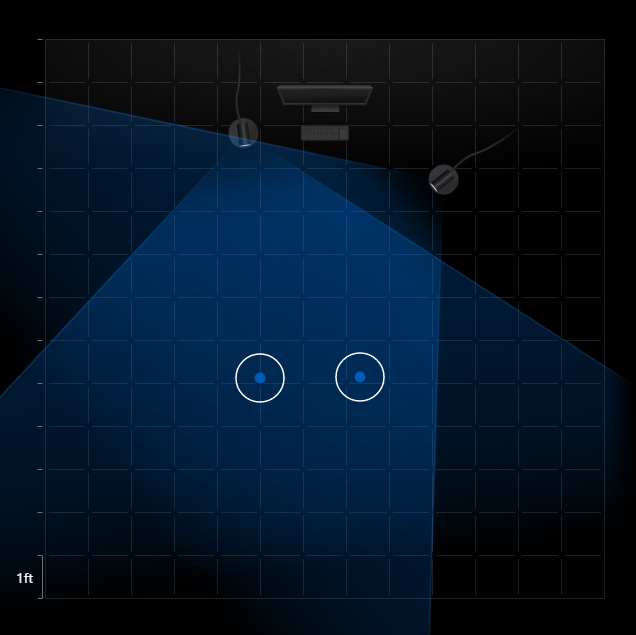

## Oculus Touch
 Oculus Touch is hand presence technology for use with the Oculus Rift.
 It launched on December 6, 2016 for $199, including one sensor.
 On July 14, 2017 Oculus began to include Touch with the $400 Rift bundle, including headset and two sensors.
 The touch was ment to directly compete with the VIVE Controller.
 
Touch Controllers are fitted with a series infrared LEDs. IR cameras are used to capture these LEDs and determine the position of the controllers. The sensors must be positioned to overlap coverage with eachother.

 
 Thanks to the buttons on the Touch Controllers being capacitive advanced gesture controll is possible. This leads to intuative and imersive expression.

Due to the prevalence of the Oculus Rift Platform and powerful Oculus OVRInput API, Touch brings meaningful interaction to a huge number of applications including NVIDIA HOLODECK, Engage Education Platform, Soundstage VR, Calcflow, and Tilt Brush.

The Oculus does does have a few weaknesses. It requires three sensors for 360 degree tracking, it can only track your hands, and is still too expensive to be mainstream.
 
Oculus Touch is the current standard for VR hand presence technology. The advances it has made will only continue to be built upon to further our interactions with the virtual world.

### References

* https://www.oculus.com/blog/oculus-touch-launches-today/
* https://www.vrfocus.com/2015/06/palmer-luckey-explains-oculus-rifts-constellation-tracking-and-fabric/
* https://developer.oculus.com/documentation/unity/latest/concepts/unity-ovrinput/
* https://trentm95.github.io/CS4331-VR/Student'sChoice/
